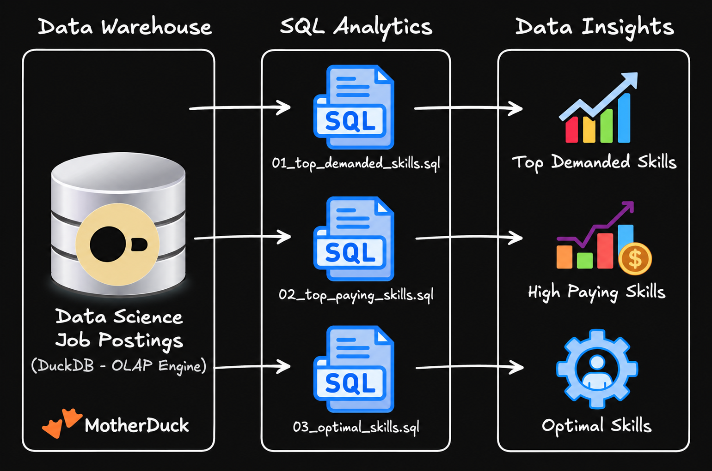
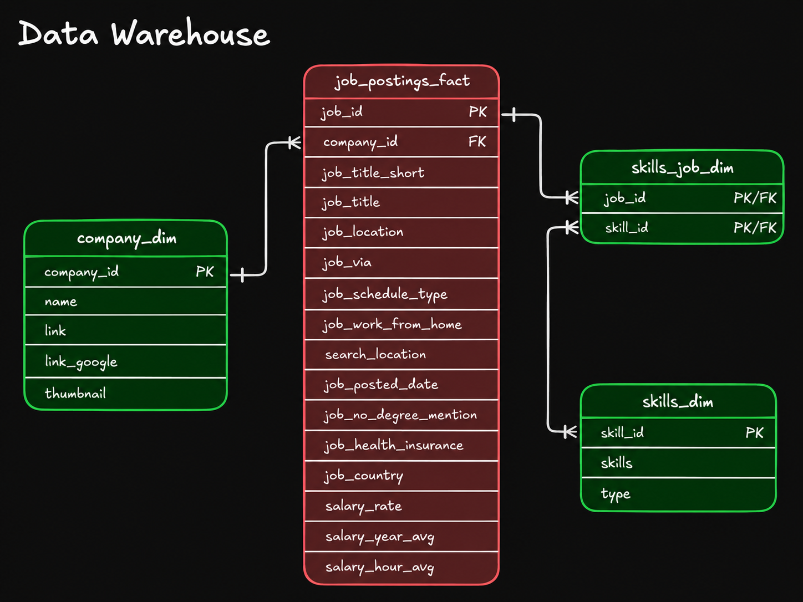

# Exploratory Data Analytics with SQL: Job Market Analysis

A SQL project analyzing the data engineer jjob market using real world job posting data. It demostrates my ability to **write production-quality analytical SQL, design efficient queries, and turn usiness questions into data-driven insights**. 

## Executive Summary

- **Project Scope:** Built **3 analytical queries** that answer key questions about the data engineer job market.
- **Data Modeling:** Used **multi-table joins** across fact and dimension tales to extract insights.
- **Analytics:** Applied **aggregations, filtering, and sorting** to find top skills by demand, salary, and overall value.
- **Outcomes:** Delivered **actionable insights** on SQL/Python dominance, cloud trends, and salary patterns. 

If only you have a minute, review these:
1. [`01_top_demanded_skills.sql`](./01_top_demanded%20_skills.sql) - demand analysis with multi-table joins.
2. [`02_top_paying_skills.sql`](./02_paying_skills.sql) - salary analysis with aggregations.
3. [`03_optimal_skills.sql`](./03_most_optimal_skill.sql) - combined demand/salary optimization query.

## Prolem & Context

Job market analysts need to answer questions like:
- **Most in-demand:** *Which skill are most in-demand for data engineers?*
- **Highest paid:** *Which skills command the highest salaries?*
- **Best trade-off:** *Which is the optimal skill set balancing demand and compensation?*

This project analyzes a **data warehouse** built using a star schema design. The warehouse structure consist of:

- **Fact Table:** `job_postings_fact` - Central table containing job posting details (jjob titles, locations, salaries, dates, etc.)
- **Dimension Tables:** 
    - `company_dim` - Company information linked to job postings
    - `skills_dim` - Skills catalog with skills names and types
- **Bridge Table:** `skills_job_dim` - Resolve the many-to-many reelationship bbetween o postings and skills.

By querying across these interconnected tables, I extracted insights about skill demand, salary patterns, and optimal skill combinations for data engineering roles. 

## Tech Stack

- **Query Engine:** DuckDB for fast OLAP-style analytical queries
- **Language:** SQL (ANSI-style with analytical functions)
- **Data Model:** Star Schema with fact + dimension + bridge tables
- **Deveelopment:** VS Code for SQL editing + Terminal for DuckDB CLI
- **Version Control** Git/Github for versioned SQL scripts

## Analysis Overview

### Query Structure

1. **[Top Demanded Skills](./01_top_demanded%20_skills.sql)** - Identifies the 10 most in-demand skills for remote data engineer positions.
2. **[Top Paying Skills](./02_paying_skills.sql)** - Analyzes the 25 highest paying skills with salary and demand metrics.
3. **[Optimal Skills](./03_most_optimal_skill.sql)** - Calculates an optimal score using natural log of demand combined with median salary to identify the most valuable skills to learn.

### Key Insights

- Core languages: SQL and Python each appear in ~29,000 job postings, making them the most valuable skills.
- Cloud platforms: AWS and Azure are critical for modern data engineering roles.
- Infra & tooling: Kubernetes, Docker, and Terraform are associated with premium salaries.
- Big data tools: Apache Spark shows strong demand with competitive compensation. 

## SQL Skills Demostrated

### Query Design & Optimization

- **Complex joins:** Multi-table `INNER JOIN` operations across `job_postings_fact`, `skills_job_dim`, and `skills_dim`.
- **Aggregations:**  `COUNT()`, `MEDIAN()`, `ROUND()` for statistical analysis.
- **Filterings:** Boolean logic with `WHERE` clauses and multiple conditions (`job_title_short`, `job_work_from_home`, `salary_year_avg IS NOT NULL`).
- **Sorting & Limiting:** `ORDER BY` with `DESC` and `LIMIT` for top-N analysis...

### Data Analysis Technique

- **Grouping:** `GROUP BY` for categorical analysis by skill
- **Conditional Logic:** `CASE WHEN` statements for derived metrics
- **Mathematical Function:** `LN()` for natural logarithm transformation to normalize demand metrics 
- **Calculated Metrics:** Derived optimal score combining log-transformed demand with median salary
- **HAVING Clause:** Filtering aggregated results (skills with >= 100 postings)
- **NULL Handlings:** Proper filterings of incomplete records (`salary_year_avg IS NOT NULL`)